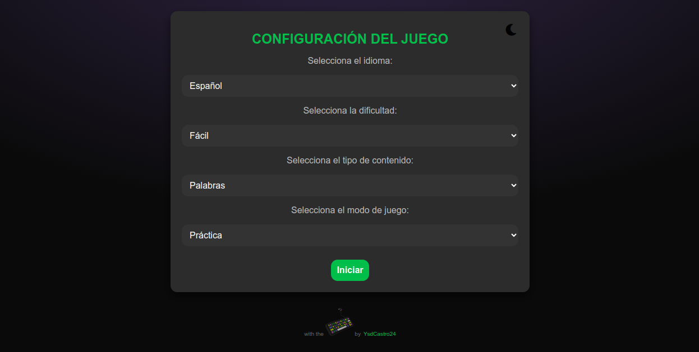
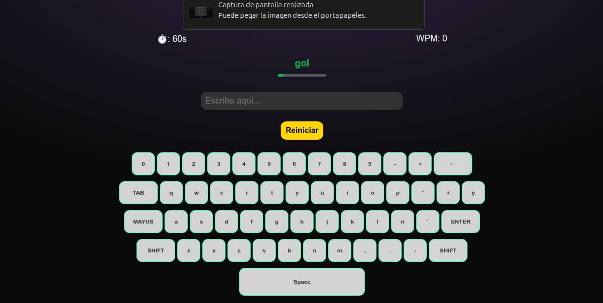
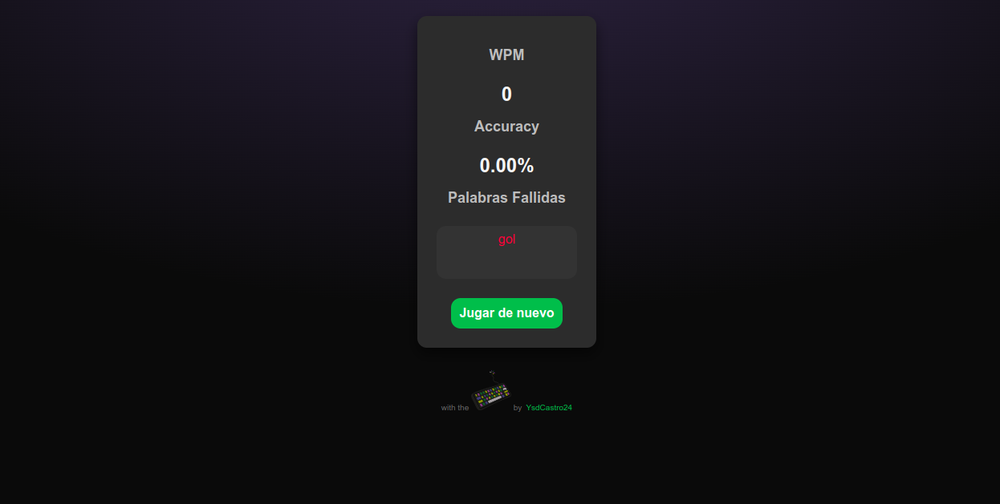

# TypoChallenge - ¡Mejora tus habilidades de mecanografía! ⌨️

¡Bienvenido a TypoChallenge! Este es un juego interactivo de mecanografía diseñado para ayudarte a mejorar tu velocidad (WPM) y precisión mientras te diviertes. Elige entre diferentes idiomas, dificultades y modos de juego, y enfrenta el desafío de escribir palabras, párrafos o nombres de ciudades contrarreloj.

## Descripción

TypoChallenge te permite:
- Practicar mecanografía en español o inglés.
- Seleccionar niveles de dificultad (fácil, medio, difícil).
- Elegir entre modos de juego: tiempo limitado o palabras limitadas.
- Recibir retroalimentación en tiempo real sobre tu WPM (palabras por minuto), precisión y palabras fallidas.
- Usar un teclado virtual (disponible en dispositivos de escritorio).

El proyecto está construido con HTML, CSS y JavaScript puro, con un diseño responsive y un tema claro/oscuro personalizable.

## Capturas de Pantalla

A continuación, te mostramos algunas imágenes del proyecto. Estas capturas se encuentran en la carpeta `assets`.

### Pantalla de Configuración

*La interfaz de configuración permite personalizar el idioma, dificultad y modo de juego.*

### Pantalla de Juego

*Ejemplo de la pantalla de juego con temporizador, WPM y palabra activa.*

### Pantalla de Resultados

*Muestra los resultados finales, incluyendo WPM, precisión y palabras fallidas.*

*(Nota: Sube las imágenes correspondientes a la carpeta `assets` y actualiza los nombres de archivo en las etiquetas `![ ]` según las imágenes que agregues.)*

## Instalación

1. Clona el repositorio en tu máquina local:
   ```bash
   git clone https://github.com/YsdCastro24/TypoChallenge.git
   
## Uso
Configuración: Selecciona el idioma (español o inglés), dificultad (fácil, medio, difícil), tipo de contenido (palabras, párrafos, ciudades) y modo de juego (tiempo limitado o palabras limitadas).

Inicio: Haz clic en el botón "Iniciar" para comenzar el juego.

Juego: Escribe las palabras que aparecen en la pantalla. Usa el teclado virtual (disponible en escritorio) o tu teclado físico.

Resultados: Al finalizar, revisa tu WPM, precisión y palabras fallidas. Haz clic en "Jugar de nuevo" para reiniciar.

Tema: Cambia entre tema claro y oscuro con el ícono en la esquina superior derecha.

## Características
Modo Claro/Oscuro: Cambia el tema con un solo clic.
Teclado Virtual: Disponible en dispositivos de escritorio para practicar la disposición de teclas.
Progreso en Tiempo Real: Barra de progreso y estadísticas actualizadas.
Responsive: Funciona en dispositivos móviles y de escritorio.


Contribución
¡Las contribuciones son bienvenidas! Si deseas mejorar TypoChallenge, sigue estos pasos:
Haz un fork del repositorio.

Crea una rama para tu función o corrección:
bash

git checkout -b feature/nueva-funcion

Realiza tus cambios y haz commit:
bash

git commit -m "Añade nueva función X"

Haz push a tu rama:
bash

git push origin feature/nueva-funcion

Abre un Pull Request en GitHub.

Agregar Contenido
Puedes agregar más palabras, párrafos o ciudades al archivo contentData.js.

Asegúrate de mantener la estructura actual para los objetos words, paragraphs y cities.

Reportar Problemas
Si encuentras errores o tienes sugerencias, crea un issue en el repositorio con una descripción detallada.
Licencia
Este proyecto está bajo la licencia MIT (LICENSE). Siéntete libre de usarlo, modificarlo y distribuirlo según los términos de la licencia.
Agradecimientos
Desarrollado con  por YsdCastro24. Gracias a la comunidad de GitHub por la inspiración y soporte.


